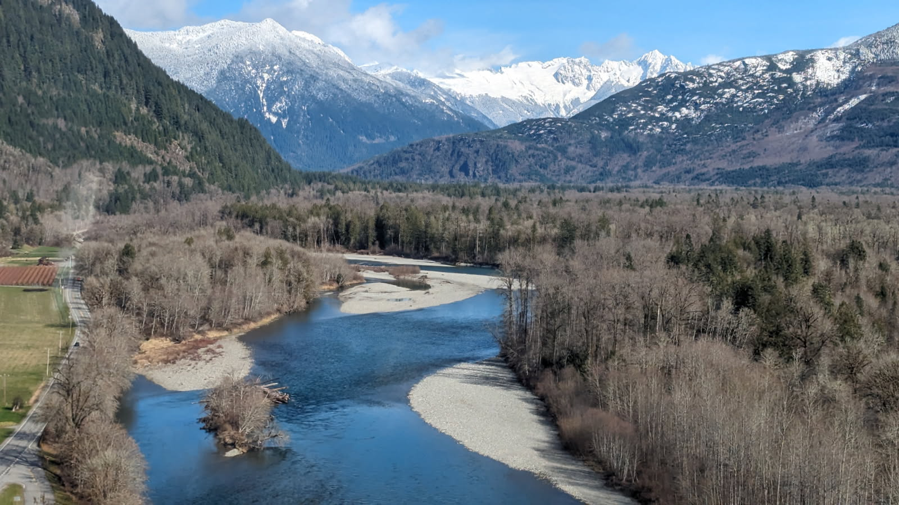

```{r setup, include=FALSE}
library(shiny)
library(flexdashboard)
library(bslib)
library(htmltools)
library(httr)       
library(jsonlite)   
library(RSocrata)
library(tidyverse)
library(lubridate)
library(hms)
library(DT)
library(reactable)
library(plotly)
library(creelutils)
```

```{r}
establish_db_con()
```

```{r}
con <- establish_db_con()

wdfw_interview <- fetch_db_table(con, "creel", "vw_analysis_interview")
wdfw_catch <- fetch_db_table(con, "creel", "vw_analysis_catch")
wdfw_creel_event <- fetch_db_table(con, "creel", "vw_creel_event")
wdfw_effort_count <- fetch_db_table(con, "creel", "vw_analysis_effort_count")
```

```{r include=FALSE}
#  Data Wrangling

#  WDFW Creel Catch *** preferred order - drop of unused variables - data prep  
wdfw_catch <- wdfw_catch |> 
  select(
    event_date, water_body, fishery_name, project_name,
    species, run, sex, fate, fork_length_cm, fish_count,
    life_stage, fish_processing_status, fin_mark,cwt_detection_status,
    snout_code,cwt_read_status, cwt_code, cwt_species, cwt_run,
    scale_card_num, scale_card_pos,scale_age_code,
    pit_detection_status,creel_event_id, interview_id, catch_id)|>  
  mutate(
    fish_count = as.numeric(fish_count), 
    fork_length_cm = as.numeric(fork_length_cm),
    event_date = ymd(event_date)
  )

#   WDFW-Creel Event  *** preferred order - drop of unused variables - data prep
wdfw_creel_event <- wdfw_creel_event |>
  rename(
    water_body = water_body_desc
  ) |>
  select(
    event_date, water_body, project_name, start_time, end_time, 
    tie_in_indicator, comments_txt, qaqc_datetime, creel_event_id )|> 
  mutate(
    tie_in_indicator = as.numeric(tie_in_indicator),
    event_date = ymd(event_date), 
    start_time = as_hms(start_time),
    end_time = as_hms(end_time),
    qaqc_datetime = as.Date(qaqc_datetime)
  )

#   WDFW-Creel Interview *** preferred order - drop of unused variables - data prep
wdfw_interview <- wdfw_interview |> 
  select(
    event_date, project_name, fishery_name, water_body, crc_area, fishing_location,
    section_num, survey_type, surveyor_num, interview_number, trip_status, previously_interviewed, 
    angler_count, total_group_count, vehicle_count, trailer_count, 
    boat_type, boat_used, fishing_start_time, fishing_end_time, interview_time,
    creel_event_id, interview_id, location_id )|> 
  mutate(
    interview_number = as.numeric(interview_number), 
    total_group_count = as.numeric(total_group_count),
    vehicle_count = as.numeric(vehicle_count),
    trailer_count = as.numeric(trailer_count),
    angler_count = as.numeric(angler_count),
    event_date = ymd(event_date), 
    interview_time = as_hms(interview_time),
    fishing_end_time = as_hms(fishing_end_time),
    fishing_start_time = as_hms(fishing_start_time)
  )

#  WDFW-Creel Effort Count *** preferred order - drop of unused variables - data prep
wdfw_effort_count <- wdfw_effort_count |> 
  select(
    event_date, project_name, fishery_name, water_body, location,
    tie_in_indicator, survey_type, count_sequence,section_num, effort_start_time, effort_end_time,
    count_quantity, count_type, location_type, surveyor_num, comments,
    p_census_boat, p_census_bank, indirect_census_bank, no_count_reason,
    creel_event_id, effort_event_id, location_id,) |> 
  arrange(
    event_date, project_name, fishery_name, water_body, location,
    tie_in_indicator, count_sequence, section_num, effort_start_time) |> 
  mutate(
    count_quantity = as.numeric(count_quantity), 
    p_census_boat = as.numeric(p_census_boat),
    p_census_bank = as.numeric(p_census_bank),
    indirect_census_bank = as.numeric(indirect_census_bank),
    event_date = ymd(event_date), 
    effort_start_time = as_hms(effort_start_time),
    effort_end_time = as_hms(effort_end_time)
  )

```


# WDFW Creel
```{r pressure, echo=FALSE, fig.cap="", out.width = '100%'}
# Load Photo                                                          Home Page


```


# Last 30 Days {data-navmenu="Recorded Catch"}
```{r echo=FALSE}
#                                                     Recorded Catch Drop Down
p1<- wdfw_catch |> 
  uncount(fish_count) |>  
  filter(
    event_date  >= today() - days(30),
    fate %in% c("Kept","Released"),
    species %in% c("Chinook", "Coho", "Pink", "Steelhead","Chum", "Sockeye")
  ) |> 
  ggplot(aes(x= event_date, y = species, color = fate)) +
  geom_point() +
  scale_color_manual(values = c("lightcoral", "turquoise")) +
  geom_jitter(width = 0.3, height = 0.1) +
  theme_bw()+
  labs(x = NULL, y = NULL, colour = NULL) +
  labs(subtitle = "WDFW Creel Recorded Catch - last 30 days") +
  theme(
    plot.subtitle = element_text(face = "italic", hjust = 0.5, size = 8),
    axis.text.x = element_text(angle = 90),
    legend.text = element_text(size = 8),
    strip.text = element_text(size = 8)
    ) +
  facet_wrap(~water_body)

ggplotly(p1)
```

# Daily Steelhead Catch  {data-navmenu="Recorded Catch"}
```{r echo=FALSE}
p2<- wdfw_catch |> 
  filter(
    event_date  >= today() - days(60),
    fate %in% c("Kept","Released"),
    species %in% c("Steelhead")) |> 
  group_by(fishery_name,event_date, species, fate)|> 
  summarize(total_catch = sum(fish_count)) |> 
  ggplot(aes(x=event_date, y= total_catch, fill = fate)) +
  geom_bar(position = "stack", stat = "identity") +
  scale_fill_manual(values = c("lightcoral", "turquoise"))+
  theme_bw()+
  labs(x = NULL, y = NULL, fill = NULL) +
  labs(subtitle = "WDFW Creel - last 30 day recorded catch total") +
  theme(
    plot.subtitle = element_text(face = "italic", hjust = 0.5, size = 6),
    axis.text.x = element_text(size = 8, angle = 90),
    legend.text = element_text(size = 8),
    strip.text = element_text(size = 8)
  ) +
  facet_wrap(~ fishery_name)

ggplotly(p2)

```

# Daily Chinook Catch  {data-navmenu="Recorded Catch"}
```{r echo=FALSE}
p2<- wdfw_catch |> 
  filter(
    event_date  >= today() - days(60),
    fate %in% c("Kept","Released"),
    species %in% c("Chinook")) |> 
  group_by(fishery_name,event_date, species, fate)|> 
  summarize(total_catch = sum(fish_count)) |> 
  ggplot(aes(x=event_date, y= total_catch, fill = fate)) +
  geom_bar(position = "stack", stat = "identity") +
  scale_fill_manual(values = c("lightcoral", "turquoise"))+
  theme_bw()+
  labs(x = NULL, y = NULL, fill = NULL) +
  labs(subtitle = "WDFW Creel - last 30 day recorded catch total") +
  theme(
    plot.subtitle = element_text(face = "italic", hjust = 0.5, size = 6),
    axis.text.x = element_text(size = 8, angle = 90),
    legend.text = element_text(size = 8),
    strip.text = element_text(size = 8)
  ) +
  facet_wrap(~ fishery_name)

ggplotly(p2)

```

# Current Year Catch by Fishery {data-navmenu="Recorded Catch"}
```{r echo=FALSE}
p3 <- wdfw_catch |>
filter(
event_date >= as.Date(paste0(year(today()), "-01-01")), # Dynamic: Current year
fate %in% c("Kept", "Released"),
species %in% c("Chinook", "Coho", "Chum", "Sockeye", "Pink", "Steelhead"),
!is.na(fish_count) # Remove NA values
) |>
group_by(project_name, fishery_name, water_body, species, fate) |>
summarize(total_catch = sum(fish_count, na.rm = TRUE), .groups = 'drop') |> # Fixed
ggplot(aes(x = total_catch, y = species, fill = fate)) +
scale_x_continuous(expand = c(0, 0), limits = c(0, NA)) +
geom_col() +
scale_fill_manual(values = c("lightcoral", "turquoise")) +
theme_bw() +
labs(x = NULL, y = NULL, fill = NULL) +
labs(subtitle = paste0("WDFW Creel ", year(today()), " - Total Recorded Catch by Fishery")) + # Dynamic subtitle
theme(
plot.subtitle = element_text(face = "italic", hjust = 0.5, size = 6),
axis.text.x = element_text(size = 8, angle = 90),
legend.text = element_text(size = 8),
strip.text = element_text(size = 8)
) +
facet_wrap(~ fishery_name)

ggplotly(p3)
```


# District 11 Current vs Previous Year {data-navmenu="Recorded Catch"}
```{r echo=FALSE}
current_year <- year(today())
previous_year <- current_year - 1

p3.1 <- wdfw_catch |>
filter(
project_name %in% c("District 11"),
year(event_date) %in% c(current_year, previous_year),
fate %in% c("Released", "Kept"),
species %in% c("Chinook", "Coho", "Pink", "Steelhead", "Chum", "Sockeye")
) |>
mutate(
year_label = factor(year(event_date), levels = c(previous_year, current_year)),
month_label = factor(month(event_date, label = TRUE), levels = month.abb)
) |>
group_by(water_body, year_label, species, month_label, fate) |>
summarize(total_count = sum(fish_count, na.rm = TRUE), .groups = 'drop') |>
ggplot(aes(x = species, y = month_label, size = total_count, color = fate)) +
geom_point(alpha = 0.6, position = position_dodge(width = 0.5)) +
scale_color_manual(values = c("lightcoral", "turquoise")) +
scale_size_continuous(range = c(1, 15), name = "Count") +
coord_flip() +
theme_bw() +
labs(
x = NULL,
y = NULL,
color = NULL,
subtitle = paste0("District 11: ", previous_year, " vs ", current_year)
) +
theme(
plot.subtitle = element_text(face = "italic", hjust = 0.5, size = 8),
axis.text.x = element_text(size = 8, angle = 45, hjust = 1),
axis.text.y = element_text(size = 8),
legend.text = element_text(size = 8),
strip.text = element_text(size = 7)
) +
facet_grid(water_body ~ year_label, scales = "free_y", space = "free_y")

ggplotly(p3.1)
```

# District 13 Current vs Previous Year {data-navmenu="Recorded Catch"}
```{r echo=FALSE}
current_year <- year(today())
previous_year <- current_year - 1

p4 <- wdfw_catch |>
filter(
project_name %in% c("District 13"),
year(event_date) %in% c(current_year, previous_year),
fate %in% c("Released", "Kept"),
species %in% c("Chinook", "Coho", "Pink", "Steelhead", "Chum", "Sockeye")
) |>
mutate(
year_label = factor(year(event_date), levels = c(previous_year, current_year)),
month_label = factor(month(event_date, label = TRUE), levels = month.abb)
) |>
group_by(water_body, year_label, species, month_label, fate) |>
summarize(total_count = sum(fish_count, na.rm = TRUE), .groups = 'drop') |>
ggplot(aes(x = species, y = month_label, size = total_count, color = fate)) +
geom_point(alpha = 0.6, position = position_dodge(width = 0.5)) +
scale_color_manual(values = c("lightcoral", "turquoise")) +
scale_size_continuous(range = c(1, 15), name = "Count") +
coord_flip() +
theme_bw() +
labs(
x = NULL,
y = NULL,
color = NULL,
subtitle = paste0("District 13: ", previous_year, " vs ", current_year)
) +
theme(
plot.subtitle = element_text(face = "italic", hjust = 0.5, size = 8),
axis.text.x = element_text(size = 8, angle = 45, hjust = 1),
axis.text.y = element_text(size = 8),
legend.text = element_text(size = 8),
strip.text = element_text(size = 7)
) +
facet_grid(water_body ~ year_label, scales = "free_y", space = "free_y")

ggplotly(p4)
```

# District 14 Current vs Previous Year {data-navmenu="Recorded Catch"}
```{r echo=FALSE}
current_year <- year(today())
previous_year <- current_year - 1

p5 <- wdfw_catch |>
filter(
project_name %in% c("District 14"),
year(event_date) %in% c(current_year, previous_year),
fate %in% c("Released", "Kept"),
species %in% c("Chinook", "Coho", "Pink", "Steelhead", "Chum", "Sockeye")
) |>
mutate(
year_label = factor(year(event_date), levels = c(previous_year, current_year)),
month_label = factor(month(event_date, label = TRUE), levels = month.abb)
) |>
group_by(water_body, year_label, species, month_label, fate) |>
summarize(total_count = sum(fish_count, na.rm = TRUE), .groups = 'drop') |>
ggplot(aes(x = species, y = month_label, size = total_count, color = fate)) +
geom_point(alpha = 0.6, position = position_dodge(width = 0.5)) +
scale_color_manual(values = c("lightcoral", "turquoise")) +
scale_size_continuous(range = c(1, 15), name = "Count") +
coord_flip() +
theme_bw() +
labs(
x = NULL,
y = NULL,
color = NULL,
subtitle = paste0("District 14: ", previous_year, " vs ", current_year)
) +
theme(
plot.subtitle = element_text(face = "italic", hjust = 0.5, size = 8),
axis.text.x = element_text(size = 8, angle = 45, hjust = 1),
axis.text.y = element_text(size = 8),
legend.text = element_text(size = 8),
strip.text = element_text(size = 7)
) +
facet_grid(water_body ~ year_label, scales = "free_y", space = "free_y")

ggplotly(p5)
```

# District 16 2022-23 {data-navmenu="Recorded Catch"}
```{r echo=FALSE}
current_year <- year(today())
previous_year <- current_year - 1

p6 <- wdfw_catch |>
filter(
project_name %in% c("District 16"),
year(event_date) %in% c(current_year, previous_year),
fate %in% c("Released", "Kept"),
species %in% c("Chinook", "Coho", "Pink", "Steelhead", "Chum", "Sockeye")
) |>
mutate(
year_label = factor(year(event_date), levels = c(previous_year, current_year)),
month_label = factor(month(event_date, label = TRUE), levels = month.abb)
) |>
group_by(water_body, year_label, species, month_label, fate) |>
summarize(total_count = sum(fish_count, na.rm = TRUE), .groups = 'drop') |>
ggplot(aes(x = species, y = month_label, size = total_count, color = fate)) +
geom_point(alpha = 0.6, position = position_dodge(width = 0.5)) +
scale_color_manual(values = c("lightcoral", "turquoise")) +
scale_size_continuous(range = c(1, 15), name = "Count") +
coord_flip() +
theme_bw() +
labs(
x = NULL,
y = NULL,
color = NULL,
subtitle = paste0("District 16: ", previous_year, " vs ", current_year)
) +
theme(
plot.subtitle = element_text(face = "italic", hjust = 0.5, size = 8),
axis.text.x = element_text(size = 8, angle = 45, hjust = 1),
axis.text.y = element_text(size = 8),
legend.text = element_text(size = 8),
strip.text = element_text(size = 7)
) +
facet_grid(water_body ~ year_label, scales = "free_y", space = "free_y")

ggplotly(p6)
```

# District 17 South 2022-23 {data-navmenu="Recorded Catch"}
```{r echo=FALSE}
current_year <- year(today())
previous_year <- current_year - 1

p7 <- wdfw_catch |>
filter(
project_name %in% c("District 17 South"),
year(event_date) %in% c(current_year, previous_year),
fate %in% c("Released", "Kept"),
species %in% c("Chinook", "Coho", "Pink", "Steelhead", "Chum", "Sockeye")
) |>
mutate(
year_label = factor(year(event_date), levels = c(previous_year, current_year)),
month_label = factor(month(event_date, label = TRUE), levels = month.abb)
) |>
group_by(water_body, year_label, species, month_label, fate) |>
summarize(total_count = sum(fish_count, na.rm = TRUE), .groups = 'drop') |>
ggplot(aes(x = species, y = month_label, size = total_count, color = fate)) +
geom_point(alpha = 0.6, position = position_dodge(width = 0.5)) +
scale_color_manual(values = c("lightcoral", "turquoise")) +
scale_size_continuous(range = c(1, 15), name = "Count") +
coord_flip() +
theme_bw() +
labs(
x = NULL,
y = NULL,
color = NULL,
subtitle = paste0("District 17 South: ", previous_year, " vs ", current_year)
) +
theme(
plot.subtitle = element_text(face = "italic", hjust = 0.5, size = 8),
axis.text.x = element_text(size = 8, angle = 45, hjust = 1),
axis.text.y = element_text(size = 8),
legend.text = element_text(size = 8),
strip.text = element_text(size = 7)
) +
facet_grid(water_body ~ year_label, scales = "free_y", space = "free_y")

ggplotly(p7)
```

# District 17 North 2022-23 {data-navmenu="Recorded Catch"}
```{r echo=FALSE}
#                                                     Recorded Catch Drop Down
current_year <- year(today())
previous_year <- current_year - 1

p8 <- wdfw_catch |>
filter(
project_name %in% c("District 17 North"),
year(event_date) %in% c(current_year, previous_year),
fate %in% c("Released", "Kept"),
species %in% c("Chinook", "Coho", "Pink", "Steelhead", "Chum", "Sockeye")
) |>
mutate(
year_label = factor(year(event_date), levels = c(previous_year, current_year)),
month_label = factor(month(event_date, label = TRUE), levels = month.abb)
) |>
group_by(water_body, year_label, species, month_label, fate) |>
summarize(total_count = sum(fish_count, na.rm = TRUE), .groups = 'drop') |>
ggplot(aes(x = species, y = month_label, size = total_count, color = fate)) +
geom_point(alpha = 0.6, position = position_dodge(width = 0.5)) +
scale_color_manual(values = c("lightcoral", "turquoise")) +
scale_size_continuous(range = c(1, 15), name = "Count") +
coord_flip() +
theme_bw() +
labs(
x = NULL,
y = NULL,
color = NULL,
subtitle = paste0("District 17 North: ", previous_year, " vs ", current_year)
) +
theme(
plot.subtitle = element_text(face = "italic", hjust = 0.5, size = 8),
axis.text.x = element_text(size = 8, angle = 45, hjust = 1),
axis.text.y = element_text(size = 8),
legend.text = element_text(size = 8),
strip.text = element_text(size = 7)
) +
facet_grid(water_body ~ year_label, scales = "free_y", space = "free_y")

ggplotly(p8)
```

# Cowlitz 2022-23 {data-navmenu="Recorded Catch"}
```{r echo=FALSE}
#                                                     Recorded Catch Drop Down
current_year <- year(today())
previous_year <- current_year - 1

p9 <- wdfw_catch |>
filter(
project_name %in% c("Cowlitz"),
year(event_date) %in% c(current_year, previous_year),
fate %in% c("Released", "Kept"),
species %in% c("Chinook", "Coho", "Pink", "Steelhead", "Chum", "Sockeye")
) |>
mutate(
year_label = factor(year(event_date), levels = c(previous_year, current_year)),
month_label = factor(month(event_date, label = TRUE), levels = month.abb)
) |>
group_by(water_body, year_label, species, month_label, fate) |>
summarize(total_count = sum(fish_count, na.rm = TRUE), .groups = 'drop') |>
ggplot(aes(x = species, y = month_label, size = total_count, color = fate)) +
geom_point(alpha = 0.6, position = position_dodge(width = 0.5)) +
scale_color_manual(values = c("lightcoral", "turquoise")) +
scale_size_continuous(range = c(1, 15), name = "Count") +
coord_flip() +
theme_bw() +
labs(
x = NULL,
y = NULL,
color = NULL,
subtitle = paste0("Cowlitz: ", previous_year, " vs ", current_year)
) +
theme(
plot.subtitle = element_text(face = "italic", hjust = 0.5, size = 8),
axis.text.x = element_text(size = 8, angle = 45, hjust = 1),
axis.text.y = element_text(size = 8),
legend.text = element_text(size = 8),
strip.text = element_text(size = 7)
) +
facet_grid(water_body ~ year_label, scales = "free_y", space = "free_y")

ggplotly(p9)
```

#  2022-23 Catch ~ Water Body {data-navmenu="Recorded Catch"}
```{r echo=FALSE}
#                                                       Recorded Catch Drop Down
p10<- wdfw_catch |>
  uncount(fish_count) |> 
  filter(
    event_date > '2022-01-01',
    fate %in% c("Released", "Kept"),
    species %in% c("Chinook", "Coho", "Pink", "Steelhead","Chum", "Sockeye")
  ) |> 
  ggplot(aes(x= event_date, y = species, color = fate))+
  geom_point() +
  scale_color_manual(values = c("lightcoral", "turquoise"))+
  geom_jitter() +
  geom_jitter(width = 0.3, height = 0.1) +
  theme_bw()+
  labs(x = NULL, y = NULL, colour = NULL)  +
  theme(
    plot.subtitle = element_text(face = "italic", hjust = 0.5, size = 6),
    axis.text = element_text(size = 6),
    axis.text.x = element_text(size = 6, angle = 90),
    legend.text = element_text(size = 6),
    strip.text = element_text(size = 6)
  ) +
  labs(subtitle = "WDFW Creel catch - recorded catch") +
  facet_wrap(~water_body)

ggplotly(p10)  
```

# UM Chin Kept * excluding fall run {data-navmenu="Catch QA_QC"}
```{r}
#                                                          Catch QA_QC Drop Down

# catches Kept UM Chinook that are run type "Spring","Summer","NA", and ignores "Fall" run type
catch_alert_1 <- wdfw_catch     
catch_alert_1[catch_alert_1 == "" ] <- NA
catch_alert_1 <- catch_alert_1 |> 
  mutate(catch_alert = fate) |> 
  mutate(catch_alert = "Unmarked Chinook Kept") |> 
  select(
    catch_alert, event_date, project_name, fishery_name, water_body,
    species, run, fin_mark,cwt_detection_status, fate, 
    fork_length_cm, creel_event_id) |> 
  filter(
    species %in% c("Chinook"),
    fate %in% c("Kept"),
    fin_mark %in% c("UM"),
    run %in% c(NA,"Spring","Summer")
  )

datatable(
  catch_alert_1,
  filter = 'top',
  extensions = 'Buttons', 
  options = list(dom = 'Brtip', buttons = c('copy', 'csv')
  )
)
```


# All CWT + (Beep) {data-navmenu="Catch QA_QC"}
```{r}
#                                                         Catch QA_QC Drop Down

# All observations with cwt_detection status of CWT +(Beep) * includes NA snout_code and CWT_codes
CWT_tracker_1 <- wdfw_catch |> 
  filter(
    cwt_detection_status %in% c("CWT + (Beep)")
  ) |>
  select(
    event_date, project_name, water_body,
    species, life_stage, sex, fin_mark, fork_length_cm, 
    cwt_detection_status, snout_code, creel_event_id
  ) 


datatable(
  CWT_tracker_1,
  filter = 'top',
  extensions = 'Buttons', 
  options = list(dom = 'Brtip', buttons = c('copy', 'csv')
  )
)
```


# CWT + (Beep) NA Snout Code {data-navmenu="Catch QA_QC"}
```{r}
#                                                          Catch QA_QC Drop Down

# if NA snout code then cross reference with cwt code
CWT_positive_with_NA_snout_code <- wdfw_catch 
CWT_positive_with_NA_snout_code[CWT_positive_with_NA_snout_code == "" ] <- NA
CWT_positive_with_NA_snout_code <- CWT_positive_with_NA_snout_code |> 
  mutate(
    CWT_Beep_NA_SnoutCode = if_else(
      cwt_detection_status == "CWT + (Beep)" & is.na(snout_code),
      "CWT + (Beep) with missing snout code", "Pass")
  ) |> 
  select(
    event_date, project_name, fishery_name, water_body,
    cwt_detection_status, snout_code,cwt_code, species,
    creel_event_id, CWT_Beep_NA_SnoutCode) |> 
  filter(
    CWT_Beep_NA_SnoutCode== "CWT + (Beep) with missing snout code"
  )


datatable(
  CWT_positive_with_NA_snout_code,
  filter = 'top',
  extensions = 'Buttons', 
  options = list(dom = 'Brtip', buttons = c('copy', 'csv')
  )
)
```

# CWT no (Beep) with Snout Code {data-navmenu="Catch QA_QC"}
```{r}
#                                                          Catch QA_QC Drop Down

# CWT no (Beep) with a Snout Code 
CWT_negative_with_snout_code <- wdfw_catch |> 
  mutate(
    CWT_Neg_with_SnoutCode = if_else(
      cwt_detection_status == "CWT - (No Beep)" & !is.na(snout_code),
      "CWT no (Beep) with snout code", "Pass")
  ) |> 
  select(
    event_date, project_name, fishery_name, water_body,
    cwt_detection_status, snout_code, species,
    creel_event_id, CWT_Neg_with_SnoutCode) |> 
  filter(
    CWT_Neg_with_SnoutCode== "CWT no (Beep) with snout code"
  )


datatable(
  CWT_negative_with_snout_code,
  filter = 'top',
  extensions = 'Buttons', 
  options = list(dom = 'Brtip', buttons = c('copy', 'csv')
  )
)
```


# Incomplete Trip Status with Fishing End Time {data-navmenu="Interviews QA_QC"}
```{r}
#                                                     Interviews QA_QC Drop Down

# QC 1 - checks for incomplete interviews that have a recorded end time
interview_QC_1 <-wdfw_interview |>
  filter(
    event_date > '2020-01-01')|>
  mutate(
    qc_1_interview = if_else(
      trip_status == "Incomplete" & !is.na(fishing_end_time),
      "Incomplete trip status with a fishing end time", "TRUE")
  ) |>
  select(
    event_date, project_name, fishery_name, water_body,
    interview_number, trip_status, fishing_start_time,
    fishing_end_time, creel_event_id, qc_1_interview ) |>
  filter(
    qc_1_interview == "Incomplete trip status with a fishing end time"
  )


datatable(
  interview_QC_1,
  filter = 'top',
  extensions = 'Buttons','Scroller',
  options = list(dom = 'Brtip', buttons = c('copy', 'csv')
  )
)

```

# Missing Trip Status {data-navmenu="Interviews QA_QC"}
```{r}
#                                                      Interview QA_QC Drop Down                                                      

# QC 2 - checks for NA trip_status
interview_QC_2 <- wdfw_interview |>
  filter(
    event_date > '2020-01-01',
    trip_status %in% c(NA)
  ) |> 
  mutate(qc_2_interview = trip_status) |> 
  mutate(qc_2_interview = "missing trip status") |> 
  select(
    event_date, project_name, fishery_name, water_body,
    interview_number,trip_status, fishing_start_time, fishing_end_time,
    interview_time, creel_event_id, qc_2_interview
  ) 


datatable(
  interview_QC_2,
  filter = 'top',
  extensions = 'Buttons', 
  options = list(dom = 'Brtip', buttons = c('copy', 'csv')
  )
)
```

# Fishing End Time > Interview Time {data-navmenu="Interviews QA_QC"}
```{r}
#                                                     Interviews QA_QC Drop Down

# QC 3 - checks for interviews with a fishing end time > interview time
interview_QC_3 <- wdfw_interview |> 
  filter(event_date > '2020-01-01') |> 
  drop_na(fishing_end_time) |> 
  mutate(
    qc_3_interview = if_else(fishing_end_time <= interview_time &!is.na(fishing_end_time),
                             "Pass","fishing end time > interview time")
  ) |> 
  select(
    event_date, project_name, fishery_name, water_body,
    interview_number, trip_status, fishing_start_time, fishing_end_time,
    interview_time, creel_event_id, qc_3_interview) |> 
  filter(
    qc_3_interview == "fishing end time > interview time"
  )


datatable(
  interview_QC_3,
  filter = 'top',
  extensions = 'Buttons', 
  options = list(dom = 'Brtip',buttons = c('copy', 'csv')
  )
)
```

# Fishing Start Time > Fishing End Time {data-navmenu="Interviews QA_QC"}
```{r}
#                                                     Interviews QA_QC Drop Down

# QC 4 - checks for interviews with a fishing start time > fishing end time
interview_QC_4 <- wdfw_interview |> 
  filter(event_date > '2020-01-01') |> 
  drop_na(fishing_end_time) |> 
  mutate(
    qc_4_interview = if_else(fishing_end_time >= fishing_start_time &!is.na(fishing_end_time),
                             "Pass","fishing start time > fishing end time")
  ) |> 
  select(
    event_date, project_name, fishery_name, water_body,
    interview_number, trip_status, fishing_start_time, fishing_end_time,
    interview_time, creel_event_id, qc_4_interview) |> 
  filter(
    qc_4_interview == "fishing start time > fishing end time"
  )


datatable(
  interview_QC_4,
  filter = 'top',
  extensions = 'Buttons', 
  options = list(dom = 'Brtip', buttons = c('copy', 'csv')
  )
)
```

# Trailer Count > Vehicle Count {data-navmenu="Interviews QA_QC"}
```{r}
#                                                     Interviews QA_QC Drop Down

# QC 5 - checks for trailer counts > vehicle counts
interview_QC_5 <- wdfw_interview |> 
  filter(event_date > '2020-01-01') |>
  drop_na(boat_used) |> 
  mutate(
    qc_5_interview = if_else(trailer_count <= vehicle_count &!is.na(boat_used),
                             "Pass","trailer count > vehicle count")
  ) |> 
  select(
    event_date,project_name, fishery_name, water_body,
    interview_number, trailer_count,vehicle_count,
    creel_event_id, qc_5_interview) |> 
  filter(
    qc_5_interview == "trailer count > vehicle count"
  ) 


datatable(
  interview_QC_5,
  filter = 'top',
  extensions = 'Buttons', 
  options = list(dom = 'Brtip', buttons = c('copy', 'csv')
  )
)
```


# Angler Count > Group Count {data-navmenu="Interviews QA_QC"}
```{r}
#                                                     Interviews QA_QC Drop Down

# QC 6 - checks for angler count > total group counts 
interview_QC_6 <- wdfw_interview |>
  filter(event_date > '2020-01-01') |>
  drop_na(total_group_count) |> 
  mutate(
    qc_6_interview = if_else(angler_count <= total_group_count &!is.na(total_group_count),
                             "Pass","angler count > total group count")
  ) |> 
  select(
    event_date, project_name, fishery_name, water_body,
    interview_number, vehicle_count, angler_count,
    total_group_count, creel_event_id, qc_6_interview)|> 
  filter(
    qc_6_interview == "angler count > total group count"
  ) 


datatable(
  interview_QC_6,
  filter = 'top',
  extensions = 'Buttons', 
  options = list(dom = 'Brtip', buttons = c('copy', 'csv')
  )
)
```


# Vehicle Count > Group Count {data-navmenu="Interviews QA_QC"}
```{r}
#                                                     Interviews QA_QC Drop Down

# QC 7 - checks for vehicle counts > total group counts 
interview_QC_7 <- wdfw_interview |> 
  filter(event_date > '2020-01-01') |>
  drop_na(vehicle_count) |> 
  mutate(
    qc_7_interview = if_else(vehicle_count <= total_group_count &!is.na(vehicle_count),
                             "Pass","vehicle count > group count")
  ) |> 
  select(
    event_date, project_name, fishery_name, water_body, 
    interview_number, vehicle_count, angler_count,
    total_group_count, vehicle_count,creel_event_id, qc_7_interview)|> 
  filter(
    qc_7_interview == "vehicle count > group count"
  ) 


datatable(
  interview_QC_7,
  filter = 'top',
  extensions = 'Buttons', 
  options = list(dom = 'Brtip', buttons = c('copy', 'csv')
  )
)
```


# NA Previously Interviewed {data-navmenu="Interviews QA_QC"}
```{r}
#                                                    Interviews QA_QC Drop Down                                              
interview_QC_8 <- wdfw_interview |> 
  filter(event_date > '2022-01-01',
         previously_interviewed %in% c(NA)) |> 
  mutate(qc_8_interview = previously_interviewed) |> 
  mutate(qc_8_interview = "NA Previously Interviewed") |> 
  select(event_date, project_name, fishery_name, water_body,
         interview_number, previously_interviewed, creel_event_id, qc_8_interview)  
  
datatable(
  interview_QC_8,
  filter = 'top',
  extensions = 'Buttons', 
  options = list(dom = 'Brtip', buttons = c('copy', 'csv')
  )
)
```


# NA Fishing Location {data-navmenu="Interviews QA_QC"}
```{r}
#                                                    Interviews QA_QC Drop Down                                              
interview_QC_9 <- wdfw_interview |> 
  filter(event_date > '2022-01-01',
         fishing_location %in% c(NA)) |> 
  mutate(qc_9_interview = fishing_location) |> 
  mutate(qc_9_interview = "NA Fishing Location") |> 
  select(event_date, project_name, fishery_name, water_body,
         interview_number, fishing_location, creel_event_id, qc_9_interview)  
  
datatable(
  interview_QC_9,
  filter = 'top',
  extensions = 'Buttons', 
  options = list(dom = 'Brtip', buttons = c('copy', 'csv')
  )
)
```


# NA Fishery Name {data-navmenu="Interviews QA_QC"}
```{r}
#                                                    Interviews QA/QC Drop Down
na_fishery_name_interview <- wdfw_interview |> 
  filter(
    fishery_name %in% c(NA), event_date > '2022-01-01') |>
  mutate(NA_fishery_name ="NA fishery name") |>
  select(
    event_date, project_name, water_body, fishery_name,
    creel_event_id, NA_fishery_name)|>   
  distinct(creel_event_id, .keep_all = TRUE) 

datatable(
  na_fishery_name_interview,
  filter = 'top',
  extensions = 'Buttons', options = list(dom = 'Brtip', buttons = c('copy', 'csv')
  )
)
```


# Effort Count Sequence Check {data-navmenu="Effort Count QA_QC"}
```{r}
#                                                   Effort Count QA/QC Drop Down 

mode <- function(x) { # function for mode from https://stackoverflow.com/questions/2547402/how-to-find-the-statistical-mode
  ux <- unique(x)
  ux[which.max(tabulate(match(x, ux)))]
}

effort_qc_1 <- wdfw_effort_count |> # calculate max value of count_seq for each date and location
  # filter(event_date > "2022-01-01") |>
  filter(tie_in_indicator == FALSE) |> 
  group_by(project_name, fishery_name, section_num, event_date, location) |> 
  summarise(
    max_cs = max(count_sequence)
  ) |> 
  left_join(
    wdfw_effort_count |> # calculate the daily mode (highest freq, assumed correct) of count_seq and join to table with counts per date per location
      filter(tie_in_indicator == FALSE) |> 
      group_by(project_name, fishery_name, section_num, event_date, creel_event_id) |> 
      summarise(
        mode_max_cs = mode(max(count_sequence))
      ),
    by = c("project_name", "fishery_name", "section_num", "event_date")
  ) |> 
  mutate(
    effort_qc_2 = if_else(max_cs < mode_max_cs, "effort count sequence error", "pass") # evaluate where max count_seq per location is < daily mode of max count_seq 
  ) |> 
  filter(effort_qc_2 == "effort count sequence error") |>
  select(
    event_date, project_name, fishery_name, section_num,
    location, max_cs, mode_max_cs, creel_event_id, effort_qc_2) |>
  arrange(event_date, fishery_name, section_num) |> 
  arrange(desc(event_date)) |> 
  distinct(creel_event_id, .keep_all = TRUE)  
  
datatable(
  effort_qc_1,
  filter = 'top',
  extensions = 'Buttons', 
  options = list(dom = 'Brtip', buttons = c('copy', 'csv')
  )
)
```

# Effort End Time > Start Time {data-navmenu="Effort Count QA_QC"}
```{r}
#                                                   Effort Count QA/QC Drop Down
effort_qc_2 <- wdfw_effort_count |>
  mutate(
    QC_2_effort = if_else(effort_start_time > effort_end_time &!is.na(count_quantity),
                          "effort start time > effort end time", "Pass")
    ) |> 
  select(event_date, project_name, fishery_name, water_body, 
         survey_type,location, count_type, effort_start_time,
         effort_end_time, creel_event_id, QC_2_effort) |> 
  filter(QC_2_effort == "effort start time > effort end time")


datatable(
  effort_qc_2,
  filter = 'top',
  extensions = 'Buttons', 
  options = list(dom = 'Brtip', buttons = c('copy', 'csv')
  )
)

```

# NA Fishery Name {data-navmenu="Effort Count QA_QC"}
```{r}
#                                                    Effort Count QA/QC Drop Down
na_fishery_name_effort <- wdfw_effort_count |> 
  filter(event_date > '2022-01-01',
         fishery_name %in% c(NA)) |> 
  mutate(NA_fishery_name = fishery_name) |>
  mutate(NA_fishery_name = "NA Fishery Name") |> 
  select(
    event_date, project_name, water_body, survey_type, surveyor_num,
    fishery_name,creel_event_id, NA_fishery_name)|>   
  distinct(creel_event_id, .keep_all = TRUE) 

datatable(
  na_fishery_name_effort,
  filter = 'top',
  extensions = 'Buttons', options = list(dom = 'Brtip', buttons = c('copy', 'csv')
  )
)
```


#  Needs Proof Stamp {data-navmenu="Creel Event QA_QC"}
```{r}
#                                                    Creel Event QA/QC Drop Down  
proofstamp <- wdfw_creel_event[is.na(wdfw_creel_event$qaqc_datetime),] |> 
  mutate(to_be_proofed = qaqc_datetime) |> 
  mutate(to_be_proofed = "Missing Proof") |> 
  select(
    event_date, project_name, water_body, start_time, end_time, 
    tie_in_indicator, comments_txt, qaqc_datetime, 
    creel_event_id, to_be_proofed
    )

datatable(
  proofstamp,
  filter = 'top',
  extensions = 'Buttons', 
  options = list(dom = 'Brtip', buttons = c('copy', 'csv')
  )
)
```


# NA Survey End Time {data-navmenu="Creel Event QA_QC"}
```{r}
#                                                    Creel Event QA/QC Drop Down
na_survey_end_time <- wdfw_creel_event |> 
  filter(event_date > '2020-01-01',
       end_time %in% c(NA)) |> 
  mutate(NA_survey_end_time = end_time) |> 
  mutate(NA_survey_end_time = "NA Survey End Time") |> 
  select(
    event_date, project_name, water_body,
    start_time, end_time, creel_event_id, NA_survey_end_time)  
  
datatable(
  na_survey_end_time,
  filter = 'top',
  extensions = 'Buttons', options = list(dom = 'Brtip', buttons = c('copy', 'csv')
  )
)
```


# Catch Table 2022-23{data-navmenu="Summary"}
```{r}
#                                                              Summary Drop Down

# catch table
catch_summary <- wdfw_catch |> 
  filter(event_date > "2022-01-01") |> 
  group_by(project_name, fishery_name, water_body, species,
           fin_mark, cwt_detection_status, fate) |>
  summarise_at(vars(fish_count),list(total_recorded_catch = sum))


reactable(
  catch_summary,
  filterable = TRUE,
  groupBy = c("project_name", "fishery_name", "water_body", "species", "fate" ),
  columns = list(
    project_name = colDef(aggregate = "unique"),
    total_recorded_catch = colDef(aggregate = "sum", format = colFormat(separators = TRUE))
  ),
  outlined = TRUE, highlight = TRUE , resizable = TRUE
)     
```

# Effort Table 2022-23 {data-navmenu="Summary"} 
```{r}
#                                                              Summary Drop Down

# effort table

################
effort_summary <- wdfw_effort_count |> 
  filter(event_date > "2022-01-01") |> 
  group_by(project_name, fishery_name, water_body, location,
           survey_type, count_type) |> 
  summarise_at(vars(count_quantity),list(total_vehicles_trailers_from_effort_counts = sum))

reactable(
  effort_summary,
  filterable = TRUE,
  groupBy = c("project_name", "fishery_name", "survey_type", "water_body", "location" ),
  columns = list(
    project_name = colDef(aggregate = "unique"),
    total_vehicles_trailers_from_effort_counts = colDef(aggregate = "sum", format = colFormat(separators = TRUE))
  ),
  outlined = TRUE, highlight = TRUE , resizable = TRUE
)     


```

# Interview Table 2022-23{data-navmenu="Summary"} 
```{r}
#                                                              Summary Drop Down

# interview table
interview_summary <- wdfw_interview |> 
  filter(event_date > "2022-01-01") |> 
  group_by(project_name, fishery_name, water_body, fishing_location,
           boat_used, boat_type, ) |> 
  summarise_at(vars(angler_count),list(total_angler_count_from_interviews = sum))


reactable(
  interview_summary,
  filterable = TRUE,
  groupBy = c("project_name", "fishery_name", "water_body", "fishing_location", "boat_used" ),
  columns = list(
    project_name = colDef(aggregate = "unique"),
    total_angler_count_from_interviews = colDef(aggregate = "sum", format = colFormat(separators = TRUE))
  ),
  outlined = TRUE, highlight = TRUE , resizable = TRUE
)     
```


