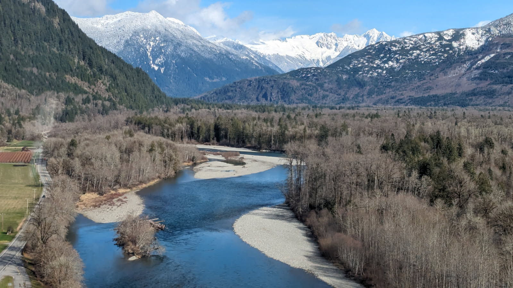

```{r setup, include=FALSE}
# Load libraries
library(shiny)
library(flexdashboard)
library(bslib)
library(htmltools)
library(httr)       
library(jsonlite)   
library(RSocrata)
library(tidyverse)
library(lubridate)
library(hms)
library(DT)
library(reactable)
library(plotly)
library(creelutils)

# Set plotly dark theme for all plots
plotly_dark_theme <- list(
  plot_bgcolor = "#222222",
  paper_bgcolor = "#222222",
  font = list(color = "#ffffff"),
  xaxis = list(gridcolor = "#444444", linecolor = "#666666"),
  yaxis = list(gridcolor = "#444444", linecolor = "#666666")
)

# Set ggplot2 dark theme
theme_dark_custom <- function() {
  theme_minimal() +
  theme(
    plot.background = element_rect(fill = "#222222", color = NA),
    panel.background = element_rect(fill = "#222222", color = NA),
    text = element_text(color = "#ffffff"),
    axis.text = element_text(color = "#cccccc"),
    strip.background = element_rect(fill = "#333333", color = NA),
    strip.text = element_text(color = "#ffffff"),
    panel.grid.major = element_line(color = "#444444"),
    panel.grid.minor = element_line(color = "#333333"),
    legend.background = element_rect(fill = "#222222", color = NA)
  )
}

# Set default theme
theme_set(theme_dark_custom())
```

```{r database-connection, echo=FALSE}
# Database connection with error handling
tryCatch({
  con <- connect_creel_db()
  
  # Load data tables
  wdfw_interview <- fetch_db_table(con, "creel", "vw_analysis_interview")
  wdfw_catch <- fetch_db_table(con, "creel", "vw_analysis_catch")
  wdfw_creel_event <- fetch_db_table(con, "creel", "vw_creel_event")
  wdfw_effort_count <- fetch_db_table(con, "creel", "vw_analysis_effort_count")
  
  # Close connection after fetching
  if (exists("con")) {
    DBI::dbDisconnect(con)
  }
}, error = function(e) {
  showNotification(
    paste("Database connection error:", e$message),
    type = "error",
    duration = NULL
  )
})
```

```{r data-wrangling, include=FALSE}
# Optimized Data Wrangling Functions

# Function to process dates and times
process_datetime <- function(df) {
  df %>%
    mutate(across(contains("date"), ~ymd(.x))) %>%
    mutate(across(contains("time") & !contains("datetime"), ~as_hms(.x))) %>%
    mutate(across(contains("datetime"), ~as.Date(.x)))
}

# Process WDFW Catch
wdfw_catch <- wdfw_catch %>% 
  select(
    event_date, water_body, fishery_name, project_name,
    species, run, sex, fate, fork_length_cm, fish_count,
    life_stage, fish_processing_status, fin_mark, cwt_detection_status,
    snout_code, cwt_read_status, cwt_code, cwt_species, cwt_run,
    scale_card_num, scale_card_pos, scale_age_code,
    pit_detection_status, creel_event_id, interview_id, catch_id
  ) %>%  
  mutate(
    fish_count = as.numeric(fish_count), 
    fork_length_cm = as.numeric(fork_length_cm)
  ) %>%
  process_datetime()

# Process WDFW Creel Event
wdfw_creel_event <- wdfw_creel_event %>%
  rename(water_body = water_body_desc) %>%
  select(
    event_date, water_body, project_name, start_time, end_time, 
    tie_in_indicator, comments_txt, qaqc_datetime, creel_event_id
  ) %>% 
  mutate(tie_in_indicator = as.numeric(tie_in_indicator)) %>%
  process_datetime()

# Process WDFW Interview
wdfw_interview <- wdfw_interview %>% 
  select(
    event_date, project_name, fishery_name, water_body, crc_area, fishing_location,
    section_num, survey_type, surveyor_num, interview_number, trip_status,
    previously_interviewed, angler_count, total_group_count, vehicle_count,
    trailer_count, boat_type, boat_used, fishing_start_time, fishing_end_time,
    interview_time, creel_event_id, interview_id, location_id
  ) %>% 
  mutate(across(c(interview_number, total_group_count, vehicle_count,
                   trailer_count, angler_count), as.numeric)) %>%
  process_datetime()

# Process WDFW Effort Count
wdfw_effort_count <- wdfw_effort_count %>% 
  select(
    event_date, project_name, fishery_name, water_body, location,
    tie_in_indicator, survey_type, count_sequence, section_num,
    effort_start_time, effort_end_time, count_quantity, count_type,
    location_type, surveyor_num, comments, p_census_boat, p_census_bank,
    indirect_census_bank, no_count_reason, creel_event_id, effort_event_id,
    location_id
  ) %>% 
  arrange(event_date, project_name, fishery_name, water_body, location,
          tie_in_indicator, count_sequence, section_num, effort_start_time) %>% 
  mutate(across(c(count_quantity, p_census_boat, p_census_bank,
                  indirect_census_bank), as.numeric)) %>%
  process_datetime()

# Create reactive values for caching
values <- reactiveValues(
  catch_filtered = NULL,
  interview_filtered = NULL,
  effort_filtered = NULL
)
```

```{r plotting-functions, include=FALSE}
# Reusable plotting functions

create_catch_plot <- function(data, title_text = "", facet_var = NULL) {
  p <- data %>%
    ggplot(aes(x = event_date, y = species, color = fate)) +
    geom_point(alpha = 0.8) +
    scale_color_manual(values = c("Kept" = "#ff6b6b", "Released" = "#4ecdc4")) +
    geom_jitter(width = 0.3, height = 0.1) +
    theme_dark_custom() +
    labs(x = NULL, y = NULL, colour = NULL, subtitle = title_text) +
    theme(
      plot.subtitle = element_text(face = "italic", hjust = 0.5, size = 10),
      axis.text.x = element_text(angle = 90),
      legend.text = element_text(size = 10)
    )
  
  if (!is.null(facet_var)) {
    p <- p + facet_wrap(as.formula(paste("~", facet_var)))
  }
  
  ggplotly(p) %>% layout(plotly_dark_theme)
}

create_bar_plot <- function(data, title_text = "", facet_var = NULL) {
  p <- data %>%
    ggplot(aes(x = event_date, y = total_catch, fill = fate)) +
    geom_bar(position = "stack", stat = "identity") +
    scale_fill_manual(values = c("Kept" = "#ff6b6b", "Released" = "#4ecdc4")) +
    theme_dark_custom() +
    labs(x = NULL, y = "Total Catch", fill = NULL, subtitle = title_text) +
    theme(
      plot.subtitle = element_text(face = "italic", hjust = 0.5, size = 8),
      axis.text.x = element_text(size = 8, angle = 90),
      legend.text = element_text(size = 8)
    )
  
  if (!is.null(facet_var)) {
    p <- p + facet_wrap(as.formula(paste("~", facet_var)))
  }
  
  ggplotly(p) %>% layout(plotly_dark_theme)
}

create_comparison_plot <- function(data, district_name) {
  current_year <- year(today())
  previous_year <- current_year - 1
  
  data %>%
    filter(
      project_name %in% district_name,
      year(event_date) %in% c(current_year, previous_year),
      fate %in% c("Released", "Kept"),
      species %in% c("Chinook", "Coho", "Pink", "Steelhead", "Chum", "Sockeye")
    ) %>%
    mutate(
      year_label = factor(year(event_date), levels = c(previous_year, current_year)),
      month_label = factor(month(event_date, label = TRUE), levels = month.abb)
    ) %>%
    group_by(water_body, year_label, species, month_label, fate) %>%
    summarize(total_count = sum(fish_count, na.rm = TRUE), .groups = 'drop') %>%
    ggplot(aes(x = species, y = month_label, size = total_count, color = fate)) +
    geom_point(alpha = 0.6, position = position_dodge(width = 0.5)) +
    scale_color_manual(values = c("Kept" = "#ff6b6b", "Released" = "#4ecdc4")) +
    scale_size_continuous(range = c(1, 15), name = "Count") +
    coord_flip() +
    theme_dark_custom() +
    labs(
      x = NULL, y = NULL, color = NULL,
      subtitle = paste0(district_name, ": ", previous_year, " vs ", current_year)
    ) +
    theme(
      plot.subtitle = element_text(face = "italic", hjust = 0.5, size = 8),
      axis.text = element_text(size = 8)
    ) +
    facet_grid(water_body ~ year_label, scales = "free_y", space = "free_y") -> p
  
  ggplotly(p) %>% layout(plotly_dark_theme)
}

# DT table with dark theme
dt_dark <- function(data) {
  datatable(
    data,
    filter = 'top',
    extensions = 'Buttons',
    options = list(
      dom = 'Brtip',
      buttons = c('copy', 'csv'),
      initComplete = JS(
        "function(settings, json) {",
        "$('body').css({'background-color': '#222222', 'color': '#ffffff'});",
        "$('.dataTables_wrapper').css({'background-color': '#222222', 'color': '#ffffff'});",
        "}"
      )
    )
  ) %>%
    formatStyle(
      columns = 1:ncol(data),
      backgroundColor = '#222222',
      color = '#ffffff'
    )
}
```

# WDFW Creel {data-icon="fa-home"}
```{r home-page, echo=FALSE, fig.cap="", out.width = '100%'}
# Note: Replace "SkagitAerial.jpg" with your actual image
# For dark mode, you might want to adjust image brightness

```

# Catch By River {data-navmenu="Recorded Catch"}
```{r last-30-days, echo=FALSE}
wdfw_catch %>% 
  uncount(fish_count) %>%  
  filter(
    event_date >= today() - days(30),
    fate %in% c("Kept", "Released"),
    species %in% c("Chinook", "Coho", "Pink", "Steelhead", "Chum", "Sockeye")
  ) %>%
  create_catch_plot("WDFW Creel Recorded Catch - Last 30 Days", "water_body")
```

# Daily Steelhead Catch {data-navmenu="Recorded Catch"}
```{r daily-steelhead, echo=FALSE}
wdfw_catch %>% 
  filter(
    event_date >= today() - days(60),
    fate %in% c("Kept", "Released"),
    species == "Steelhead"
  ) %>% 
  group_by(fishery_name, event_date, species, fate) %>% 
  summarize(total_catch = sum(fish_count, na.rm = TRUE), .groups = 'drop') %>%
  create_bar_plot("WDFW Creel - Steelhead Daily Catch", "fishery_name")
```

# Daily Chinook Catch {data-navmenu="Recorded Catch"}
```{r daily-chinook, echo=FALSE}
wdfw_catch %>% 
  filter(
    event_date >= today() - days(60),
    fate %in% c("Kept", "Released"),
    species == "Chinook"
  ) %>% 
  group_by(fishery_name, event_date, species, fate) %>% 
  summarize(total_catch = sum(fish_count, na.rm = TRUE), .groups = 'drop') %>%
  create_bar_plot("WDFW Creel - Chinook Daily Catch", "fishery_name")
```

# Current Year Catch by Fishery {data-navmenu="Recorded Catch"}
```{r current-year-catch, echo=FALSE}
current_year <- year(today())

wdfw_catch %>%
  filter(
    event_date >= as.Date(paste0(current_year, "-01-01")),
    fate %in% c("Kept", "Released"),
    species %in% c("Chinook", "Coho", "Chum", "Sockeye", "Pink", "Steelhead"),
    !is.na(fish_count)
  ) %>%
  group_by(project_name, fishery_name, water_body, species, fate) %>%
  summarize(total_catch = sum(fish_count, na.rm = TRUE), .groups = 'drop') %>%
  ggplot(aes(x = total_catch, y = species, fill = fate)) +
  scale_x_continuous(expand = c(0, 0), limits = c(0, NA)) +
  geom_col() +
  scale_fill_manual(values = c("Kept" = "#ff6b6b", "Released" = "#4ecdc4")) +
  theme_dark_custom() +
  labs(
    x = NULL, y = NULL, fill = NULL,
    subtitle = paste0("WDFW Creel ", current_year, " - Total Recorded Catch by Fishery")
  ) +
  facet_wrap(~ fishery_name) -> p

ggplotly(p) %>% layout(plotly_dark_theme)
```

# District 11 Current vs Previous Year {data-navmenu="Recorded Catch"}
```{r district-11, echo=FALSE}
create_comparison_plot(wdfw_catch, "District 11")
```

# District 13 Current vs Previous Year {data-navmenu="Recorded Catch"}
```{r district-13, echo=FALSE}
create_comparison_plot(wdfw_catch, "District 13")
```

# District 14 Current vs Previous Year {data-navmenu="Recorded Catch"}
```{r district-14, echo=FALSE}
create_comparison_plot(wdfw_catch, "District 14")
```

# District 16 Current vs Previous Year {data-navmenu="Recorded Catch"}
```{r district-16, echo=FALSE}
create_comparison_plot(wdfw_catch, "District 16")
```

# District 17 South Current vs Previous Year {data-navmenu="Recorded Catch"}
```{r district-17-south, echo=FALSE, eval=FALSE}
#create_comparison_plot(wdfw_catch, "District 17 South")
```

# District 17 North Current vs Previous Year {data-navmenu="Recorded Catch"}
```{r district-17-north, echo=FALSE}
create_comparison_plot(wdfw_catch, "District 17 North")
```

# Cowlitz Current vs Previous Year {data-navmenu="Recorded Catch"}
```{r cowlitz, echo=FALSE}
create_comparison_plot(wdfw_catch, "Cowlitz")
```

# Recorded Catch by Water Body {data-navmenu="Recorded Catch"}
```{r water-body-interactive, eval=FALSE, include=FALSE}
water_bodies <- wdfw_catch %>%
  filter(
    event_date > '2022-01-01',
    fate %in% c("Released", "Kept"),
    species %in% c("Chinook", "Coho", "Pink", "Steelhead", "Chum", "Sockeye")
  ) %>%
  pull(water_body) %>%
  unique() %>%
  sort()

# Create select input
selectInput(
  inputId = "water_body_select",
  label = "Select Water Body:",
  choices = c("All Water Bodies" = "all", water_bodies),
  selected = "all",
  multiple = FALSE
)

# Reactive plot with caching
renderPlotly({
  # Use reactive caching
  filtered_data <- reactive({
    data <- wdfw_catch %>%
      uncount(fish_count) %>%
      filter(
        event_date > '2022-01-01',
        fate %in% c("Released", "Kept"),
        species %in% c("Chinook", "Coho", "Pink", "Steelhead", "Chum", "Sockeye")
      )
    
    if (input$water_body_select != "all") {
      data <- data %>% filter(water_body == input$water_body_select)
    }
    data
  })
  
  # Create plot
  p <- filtered_data() %>%
    ggplot(aes(x = event_date, y = species, color = fate)) +
    geom_point(alpha = 0.8) +
    scale_color_manual(values = c("Kept" = "#ff6b6b", "Released" = "#4ecdc4")) +
    geom_jitter(width = 0.3, height = 0.1) +
    theme_dark_custom() +
    labs(x = NULL, y = NULL, colour = NULL, subtitle = "WDFW Creel - Recorded Catch")
  
  if (input$water_body_select == "all") {
    p <- p + facet_wrap(~water_body)
  }
  
  ggplotly(p) %>% layout(plotly_dark_theme)
})
```

# UM Chin Kept * excluding fall run {data-navmenu="Catch QA_QC"}
```{r um-chin-kept, echo=FALSE}
catch_alert_1 <- wdfw_catch
catch_alert_1[catch_alert_1 == ""] <- NA
catch_alert_1 %>%
  mutate(catch_alert = "Unmarked Chinook Kept") %>%
  select(
    catch_alert, event_date, project_name, fishery_name, water_body,
    species, run, fin_mark, cwt_detection_status, fate,
    fork_length_cm, creel_event_id
  ) %>%
  filter(
    species == "Chinook",
    fate == "Kept",
    fin_mark == "UM",
    run %in% c(NA, "Spring", "Summer")
  ) %>%
  dt_dark()
```

# All CWT + (Beep) {data-navmenu="Catch QA_QC"}
```{r cwt-beep, echo=FALSE}
wdfw_catch %>% 
  filter(cwt_detection_status == "CWT + (Beep)") %>%
  select(
    event_date, project_name, water_body,
    species, life_stage, sex, fin_mark, fork_length_cm,
    cwt_detection_status, snout_code, creel_event_id
  ) %>%
  dt_dark()
```

# CWT + (Beep) NA Snout Code {data-navmenu="Catch QA_QC"}
```{r cwt-na-snout, echo=FALSE}
CWT_positive_with_NA_snout_code <- wdfw_catch
CWT_positive_with_NA_snout_code[CWT_positive_with_NA_snout_code == ""] <- NA
CWT_positive_with_NA_snout_code %>%
  mutate(
    CWT_Beep_NA_SnoutCode = if_else(
      cwt_detection_status == "CWT + (Beep)" & is.na(snout_code),
      "CWT + (Beep) with missing snout code", "Pass"
    )
  ) %>%
  select(
    event_date, project_name, fishery_name, water_body,
    cwt_detection_status, snout_code, cwt_code, species,
    creel_event_id, CWT_Beep_NA_SnoutCode
  ) %>%
  filter(CWT_Beep_NA_SnoutCode == "CWT + (Beep) with missing snout code") %>%
  dt_dark()
```

# CWT no (Beep) with Snout Code {data-navmenu="Catch QA_QC"}
```{r cwt-no-beep, echo=FALSE}
wdfw_catch %>%
  mutate(
    CWT_Neg_with_SnoutCode = if_else(
      cwt_detection_status == "CWT - (No Beep)" & !is.na(snout_code),
      "CWT no (Beep) with snout code", "Pass"
    )
  ) %>%
  select(
    event_date, project_name, fishery_name, water_body,
    cwt_detection_status, snout_code, species,
    creel_event_id, CWT_Neg_with_SnoutCode
  ) %>%
  filter(CWT_Neg_with_SnoutCode == "CWT no (Beep) with snout code") %>%
  dt_dark()
```

# Incomplete Trip Status with Fishing End Time {data-navmenu="Interviews QA_QC"}
```{r interview-qc1, echo=FALSE}
wdfw_interview %>%
  filter(event_date > '2020-01-01') %>%
  mutate(
    qc_1_interview = if_else(
      trip_status == "Incomplete" & !is.na(fishing_end_time),
      "Incomplete trip status with a fishing end time", "TRUE"
    )
  ) %>%
  select(
    event_date, project_name, fishery_name, water_body,
    interview_number, trip_status, fishing_start_time,
    fishing_end_time, creel_event_id, qc_1_interview
  ) %>%
  filter(qc_1_interview == "Incomplete trip status with a fishing end time") %>%
  dt_dark()
```

# Missing Trip Status {data-navmenu="Interviews QA_QC"}
```{r interview-qc2, echo=FALSE}
wdfw_interview %>%
  filter(
    event_date > '2020-01-01',
    is.na(trip_status)
  ) %>%
  mutate(qc_2_interview = "missing trip status") %>%
  select(
    event_date, project_name, fishery_name, water_body,
    interview_number, trip_status, fishing_start_time, fishing_end_time,
    interview_time, creel_event_id, qc_2_interview
  ) %>%
  dt_dark()
```

# Fishing End Time > Interview Time {data-navmenu="Interviews QA_QC"}
```{r interview-qc3, echo=FALSE}
wdfw_interview %>%
  filter(event_date > '2020-01-01') %>%
  drop_na(fishing_end_time) %>%
  mutate(
    qc_3_interview = if_else(
      fishing_end_time <= interview_time & !is.na(fishing_end_time),
      "Pass", "fishing end time > interview time"
    )
  ) %>%
  select(
    event_date, project_name, fishery_name, water_body,
    interview_number, trip_status, fishing_start_time, fishing_end_time,
    interview_time, creel_event_id, qc_3_interview
  ) %>%
  filter(qc_3_interview == "fishing end time > interview time") %>%
  dt_dark()
```

# Fishing Start Time > Fishing End Time {data-navmenu="Interviews QA_QC"}
```{r interview-qc4, echo=FALSE}
wdfw_interview %>%
  filter(event_date > '2020-01-01') %>%
  drop_na(fishing_end_time) %>%
  mutate(
    qc_4_interview = if_else(
      fishing_end_time >= fishing_start_time & !is.na(fishing_end_time),
      "Pass", "fishing start time > fishing end time"
    )
  ) %>%
  select(
    event_date, project_name, fishery_name, water_body,
    interview_number, trip_status, fishing_start_time, fishing_end_time,
    interview_time, creel_event_id, qc_4_interview
  ) %>%
  filter(qc_4_interview == "fishing start time > fishing end time") %>%
  dt_dark()
```

# Trailer Count > Vehicle Count {data-navmenu="Interviews QA_QC"}
```{r interview-qc5, echo=FALSE}
wdfw_interview %>%
  filter(event_date > '2020-01-01') %>%
  drop_na(boat_used) %>%
  mutate(
    qc_5_interview = if_else(
      trailer_count <= vehicle_count & !is.na(boat_used),
      "Pass", "trailer count > vehicle count"
    )
  ) %>%
  select(
    event_date, project_name, fishery_name, water_body,
    interview_number, trailer_count, vehicle_count,
    creel_event_id, qc_5_interview
  ) %>%
  filter(qc_5_interview == "trailer count > vehicle count") %>%
  dt_dark()
```

# Angler Count > Group Count {data-navmenu="Interviews QA_QC"}
```{r interview-qc6, echo=FALSE}
wdfw_interview %>%
  filter(event_date > '2020-01-01') %>%
  drop_na(total_group_count) %>%
  mutate(
    qc_6_interview = if_else(
      angler_count <= total_group_count & !is.na(total_group_count),
      "Pass", "angler count > total group count"
    )
  ) %>%
  select(
    event_date, project_name, fishery_name, water_body,
    interview_number, vehicle_count, angler_count,
    total_group_count, creel_event_id, qc_6_interview
  ) %>%
  filter(qc_6_interview == "angler count > total group count") %>%
  dt_dark()
```

# Vehicle Count > Group Count {data-navmenu="Interviews QA_QC"}
```{r interview-qc7, echo=FALSE}
wdfw_interview %>%
  filter(event_date > '2020-01-01') %>%
  drop_na(vehicle_count) %>%
  mutate(
    qc_7_interview = if_else(
      vehicle_count <= total_group_count & !is.na(vehicle_count),
      "Pass", "vehicle count > group count"
    )
  ) %>%
  select(
    event_date, project_name, fishery_name, water_body,
    interview_number, vehicle_count, angler_count,
    total_group_count, creel_event_id, qc_7_interview
  ) %>%
  filter(qc_7_interview == "vehicle count > group count") %>%
  dt_dark()
```

# NA Previously Interviewed {data-navmenu="Interviews QA_QC"}
```{r interview-qc8, echo=FALSE}
wdfw_interview %>%
  filter(
    event_date > '2022-01-01',
    is.na(previously_interviewed)
  ) %>%
  mutate(qc_8_interview = "NA Previously Interviewed") %>%
  select(
    event_date, project_name, fishery_name, water_body,
    interview_number, previously_interviewed, creel_event_id, qc_8_interview
  ) %>%
  dt_dark()
```

# NA Fishing Location {data-navmenu="Interviews QA_QC"}
```{r interview-qc9, echo=FALSE}
wdfw_interview %>%
  filter(
    event_date > '2022-01-01',
    is.na(fishing_location)
  ) %>%
  mutate(qc_9_interview = "NA Fishing Location") %>%
  select(
    event_date, project_name, fishery_name, water_body,
    interview_number, fishing_location, creel_event_id, qc_9_interview
  ) %>%
  dt_dark()
```

# NA Fishery Name {data-navmenu="Interviews QA_QC"}
```{r interview-na-fishery, echo=FALSE}
wdfw_interview %>%
  filter(
    is.na(fishery_name),
    event_date > '2022-01-01'
  ) %>%
  mutate(NA_fishery_name = "NA fishery name") %>%
  select(
    event_date, project_name, water_body, fishery_name,
    creel_event_id, NA_fishery_name
  ) %>%
  distinct(creel_event_id, .keep_all = TRUE) %>%
  dt_dark()
```

# Effort Count Sequence Check {data-navmenu="Effort Count QA_QC"}
```{r effort-qc1, echo=FALSE}
# Define mode function
mode <- function(x) {
  ux <- unique(x)
  ux[which.max(tabulate(match(x, ux)))]
}

wdfw_effort_count %>%
  filter(tie_in_indicator == FALSE) %>%
  group_by(project_name, fishery_name, section_num, event_date, location) %>%
  summarise(max_cs = max(count_sequence), .groups = 'drop') %>%
  left_join(
    wdfw_effort_count %>%
      filter(tie_in_indicator == FALSE) %>%
      group_by(project_name, fishery_name, section_num, event_date, creel_event_id) %>%
      summarise(mode_max_cs = mode(max(count_sequence)), .groups = 'drop'),
    by = c("project_name", "fishery_name", "section_num", "event_date")
  ) %>%
  mutate(
    effort_qc_2 = if_else(
      max_cs < mode_max_cs,
      "effort count sequence error", "pass"
    )
  ) %>%
  filter(effort_qc_2 == "effort count sequence error") %>%
  select(
    event_date, project_name, fishery_name, section_num,
    location, max_cs, mode_max_cs, creel_event_id, effort_qc_2
  ) %>%
  arrange(desc(event_date)) %>%
  distinct(creel_event_id, .keep_all = TRUE) %>%
  dt_dark()
```

# Effort End Time > Start Time {data-navmenu="Effort Count QA_QC"}
```{r effort-qc2, echo=FALSE}
wdfw_effort_count %>%
  mutate(
    QC_2_effort = if_else(
      effort_start_time > effort_end_time & !is.na(count_quantity),
      "effort start time > effort end time", "Pass"
    )
  ) %>%
  select(
    event_date, project_name, fishery_name, water_body,
    survey_type, location, count_type, effort_start_time,
    effort_end_time, creel_event_id, QC_2_effort
  ) %>%
  filter(QC_2_effort == "effort start time > effort end time") %>%
  dt_dark()
```

# NA Fishery Name {data-navmenu="Effort Count QA_QC"}
```{r effort-na-fishery, echo=FALSE}
wdfw_effort_count %>%
  filter(
    event_date > '2022-01-01',
    is.na(fishery_name)
  ) %>%
  mutate(NA_fishery_name = "NA Fishery Name") %>%
  select(
    event_date, project_name, water_body, survey_type, surveyor_num,
    fishery_name, creel_event_id, NA_fishery_name
  ) %>%
  distinct(creel_event_id, .keep_all = TRUE) %>%
  dt_dark()
```

# Needs Proof Stamp {data-navmenu="Creel Event QA_QC"}
```{r proof-stamp, echo=FALSE}
wdfw_creel_event %>%
  filter(is.na(qaqc_datetime)) %>%
  mutate(to_be_proofed = "Missing Proof") %>%
  select(
    event_date, project_name, water_body, start_time, end_time,
    tie_in_indicator, comments_txt, qaqc_datetime,
    creel_event_id, to_be_proofed
  ) %>%
  dt_dark()
```

# NA Survey End Time {data-navmenu="Creel Event QA_QC"}
```{r na-survey-end, echo=FALSE}
wdfw_creel_event %>%
  filter(
    event_date > '2020-01-01',
    is.na(end_time)
  ) %>%
  mutate(NA_survey_end_time = "NA Survey End Time") %>%
  select(
    event_date, project_name, water_body,
    start_time, end_time, creel_event_id, NA_survey_end_time
  ) %>%
  dt_dark()
```

# Catch Table 2022-23 {data-navmenu="Summary"}
```{r catch-summary, echo=FALSE}
wdfw_catch %>%
  filter(event_date > "2022-01-01") %>%
  group_by(
    project_name, fishery_name, water_body, species,
    fin_mark, cwt_detection_status, fate
  ) %>%
  summarise(total_recorded_catch = sum(fish_count, na.rm = TRUE), .groups = 'drop') %>%
  reactable(
    filterable = TRUE,
    groupBy = c("project_name", "fishery_name", "water_body", "species", "fate"),
    columns = list(
      project_name = colDef(aggregate = "unique"),
      total_recorded_catch = colDef(aggregate = "sum", format = colFormat(separators = TRUE))
    ),
    outlined = TRUE,
    highlight = TRUE,
    resizable = TRUE,
    theme = reactableTheme(
      color = "#ffffff",
      backgroundColor = "#222222",
      borderColor = "#444444",
      stripedColor = "#2a2a2a",
      highlightColor = "#333333",
      inputStyle = list(backgroundColor = "#333333", color = "#ffffff"),
      selectStyle = list(backgroundColor = "#333333", color = "#ffffff"),
      pageButtonHoverStyle = list(backgroundColor = "#333333"),
      pageButtonActiveStyle = list(backgroundColor = "#444444")
    )
  )
```

# Effort Table 2022-23 {data-navmenu="Summary"}
```{r effort-summary, echo=FALSE}
wdfw_effort_count %>%
  filter(event_date > "2022-01-01") %>%
  group_by(
    project_name, fishery_name, water_body, location,
    survey_type, count_type
  ) %>%
  summarise(
    total_vehicles_trailers_from_effort_counts = sum(count_quantity, na.rm = TRUE),
    .groups = 'drop'
  ) %>%
  reactable(
    filterable = TRUE,
    groupBy = c("project_name", "fishery_name", "survey_type", "water_body", "location"),
    columns = list(
      project_name = colDef(aggregate = "unique"),
      total_vehicles_trailers_from_effort_counts = colDef(
        aggregate = "sum",
        format = colFormat(separators = TRUE)
      )
    ),
    outlined = TRUE,
    highlight = TRUE,
    resizable = TRUE,
    theme = reactableTheme(
      color = "#ffffff",
      backgroundColor = "#222222",
      borderColor = "#444444",
      stripedColor = "#2a2a2a",
      highlightColor = "#333333"
    )
  )
```

# Interview Table 2022-23 {data-navmenu="Summary"}
```{r interview-summary, echo=FALSE}
wdfw_interview %>%
  filter(event_date > "2022-01-01") %>%
  group_by(
    project_name, fishery_name, water_body, fishing_location,
    boat_used, boat_type
  ) %>%
  summarise(
    total_angler_count_from_interviews = sum(angler_count, na.rm = TRUE),
    .groups = 'drop'
  ) %>%
  reactable(
    filterable = TRUE,
    groupBy = c("project_name", "fishery_name", "water_body", "fishing_location", "boat_used"),
    columns = list(
      project_name = colDef(aggregate = "unique"),
      total_angler_count_from_interviews = colDef(
        aggregate = "sum",
        format = colFormat(separators = TRUE)
      )
    ),
    outlined = TRUE,
    highlight = TRUE,
    resizable = TRUE,
    theme = reactableTheme(
      color = "#ffffff",
      backgroundColor = "#222222",
      borderColor = "#444444",
      stripedColor = "#2a2a2a",
      highlightColor = "#333333"
    )
  )
```